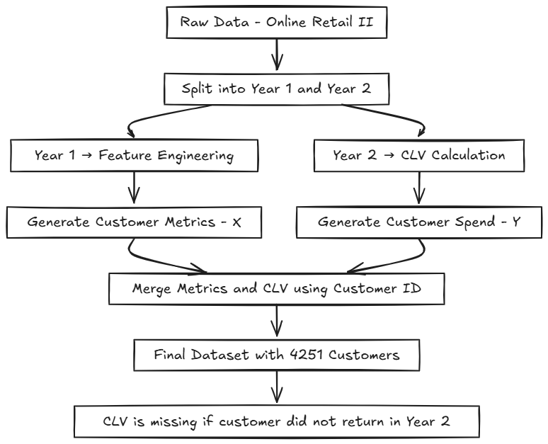

# Phase 1 – Data Exploration & Feature Engineering of Raw Transactional Data

## Project Overview

In **Phase 1**, the objective was to transform raw transactional data into `customer-level features` suitable for predicting **Customer Lifetime Value (CLV)**. This phase involved cleaning, aggregating, and segmenting the raw data, followed by the creation of meaningful features that reflect customer behavior over time.

## Dataset Overview

The dataset used for this phase is the **Online Retail II** dataset, containing transaction data for two consecutive years:

- **Year 1**: November 2009 – October 2010
- **Year 2**: November 2010 – October 2011

The dataset has a total of:

- Year 1: **520,000+ rows**
- Year 2: **540,000+ rows**

### Columns:

- **Invoice** | **StockCode** | **Description** | **Quantity** | **InvoiceDate** | **Price** | **Customer ID** | **Country**

## Data Preprocessing & Segmentation

1. **Splitting by Year**: Two separate worksheet were given:
   - Sheet 1: 2009-2010
   - Sheet 2: 2010-2011
2. **Cleaning**: Removed invalid entries, such as:
   - Missing `Customer ID`
   - Negative quantities
   - Canceled orders (identified by invoices starting with 'C')
3. **Customer Segmentation**: Identified repeat customers present across both years for longitudinal analysis.

> NOTE: A proper notes of deep analysis of all the column and posiible approach has been attached in the folder named as `CLV_Notes.pdf`

## Feature Engineering

### <u>Feature Crafting (Year 1)</u>

In **Year 1**, we aggregated the data at the **customer level** and created the following features:

| Feature             | Description                                |
| ------------------- | ------------------------------------------ |
| `Customer ID`       | Unique customer identifier                 |
| `TotalSpend`        | Total monetary value spent                 |
| `PurchaseFrequency` | Number of unique purchases per customer    |
| `OrderHabit`        | Average quantity per order                 |
| `Recency`           | Days since the last purchase               |
| `AvgPurchaseGap`    | Average time gap between purchases         |
| `Tenure`            | Time between first and last purchase       |
| `Trend`             | Spending trend over months                 |
| `Churn`             | Flag for customers not returning in Year 2 |
| `ReturnRate`        | Percentage of returned products            |

### <u>CLV Calculation (Year 2)</u>

We used Year 2 data to calculate **CLV**:

- **CLV = TotalSpend in Year- '2'**
- For customers who did not make any purchases in Year 2, their **CLV is marked as NaN**, indicating potential churn.

## Merging Year 1 & Year 2

We merged the **customer-level features** from Year 1 with the **CLV** from Year 2 based on the `Customer ID`.

### Final Merged Dataset

The merged dataset consists of **4,251 unique customers** who were active in Year 1 and Year 2, with customers who did not return in Year 2 having a CLV of **NaN**.

| Dataset Type                     | Count   |
| -------------------------------- | ------- |
| Customers in Year 1              | ~4,300  |
| Customers **retained** in Year 2 | ~2,800  |
| Final Merged Dataset             | `4,251` |
| CLV missing (**churned**)        | ~1,400  |

## Visualizations & Diagrams

You may consider adding visual assets here to further illustrate the following:

- **Data Flow Diagram**: Show's how raw data from Year 1 and Year 2 is processed into customer-level features and then merged for the final dataset.

## Key Achievements

- Cleaned and segmented the raw transactional data into customer-level metrics.
- Created meaningful features based on business logic and customer behavior.
- Merged Year 1 features with Year 2 CLV to form the final dataset for modeling.

This concludes **Phase 1**. In the next phase, we will move on to model development, training, and evaluation.

---
