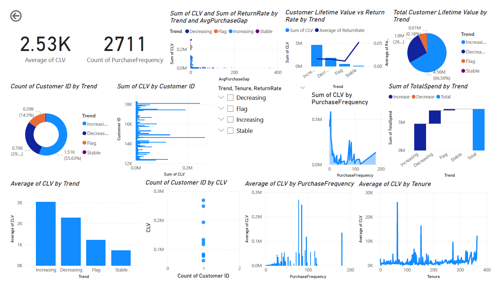

  
  
  
  
  
  
  
  
  

# Customer Lifetime Value (CLV) Prediction System

This project builds a full pipeline for **predicting 12-month Customer Lifetime Value (CLV)** using raw e-commerce transactional data. From data cleaning and feature engineering to model selection and deployment via a custom Streamlit dashboard, every step has been executed with industry standards in mind.

> Developed as part of **Celebal Summer Internship**  
> **CSI_ID**: _CT_CSI_DS_2794_  
> **Author**: _Sushil Kumar Patra, Data Science Intern_

---

## Project Summary

The original dataset comes from the **Online Retail II** repository, containing over **1 million raw transactional records** from **two years (2009–2011)**. The challenge was to:

- Convert raw logs into **customer-level metrics**
- Engineer features that reflect **purchase behavior, engagement, and churn**
- Train and tune models to **accurately predict CLV**
- Deploy a user-friendly **Streamlit application** that performs real-time predictions and business insights

> - The final deployed model initially achieved an **R² of 0.75**, but after addressing overfitting and improving generalization, it consistently reached an **R² of 0.63** on validation.
> - This performance is notably strong given the raw, behavior-only dataset with no demographic or external enrichment.
> - The outcome reflects a **robust, scalable, and industry-aligned** CLV prediction system ready for real-world deployment.

**Business Insight**
> An interactive **Power BI dashboard** was also created to visually explore key customer metrics, behavior patterns, and trends. It complements the model by offering real-time insights for stakeholders and decision-makers.

---

## Streamlit App Overview

A fully interactive, lightweight dashboard built with **Streamlit**.

Features include:

- Real-time CLV prediction from user-friendly inputs
- Internally calculated composite features
- Customer risk assessment module (recency, return rate, engagement)
- Prediction history with trends, summaries, and export options
- Business recommendations based on behavior

_Screenshots Available in `assets/`_

[Click here to use the deployed app](https://your-app-url)

.jpg)
.png)

---

## Phased Approach

### Phase 1 – Feature Engineering & Dataset Creation

- Processed two years of raw invoice-level data
- Generated **customer-level metrics** like total spend, recency, order habit, and return rate
- Merged and labeled **Year 1 features** and **Year 2 CLV**, resulting in a clean dataset of **4,251 unique customers**
- Removed non-returning users (CLV = NaN), yielding **~2,700 valid records**

### Phase 2 – Modeling & Feature Refinement

- Evaluated Linear Regression and Tree-based models
- Identified **tree models (XGBoost, Random Forest)** as better fits due to non-linear feature interactions
- Engineered advanced composite features and performed manual feature set tuning
- Achieved best cross-validated performance with **XGBoost**

### Phase 3 – Finalization & Deployment

- Final model trained using **XGBoost** with hyperparameter tuning
- Exported model and selected features for inference
- Built and styled a robust Streamlit interface
- Incorporated real-time prediction, session-based history tracking, customer risk classification, and lifecycle segmentation

---

## Final Note

This project represents a complete and scalable solution for CLV prediction using only transactional logs — without relying on sensitive or unavailable customer attributes. It demonstrates strong data understanding, model interpretability, and full-cycle deployment.

> **Built by**: Sushil Kumar Patra  
> **CSI_ID**: CT_CSI_DS_2794  > **Internship**: Celebal Summer Internship – Data Science Track
